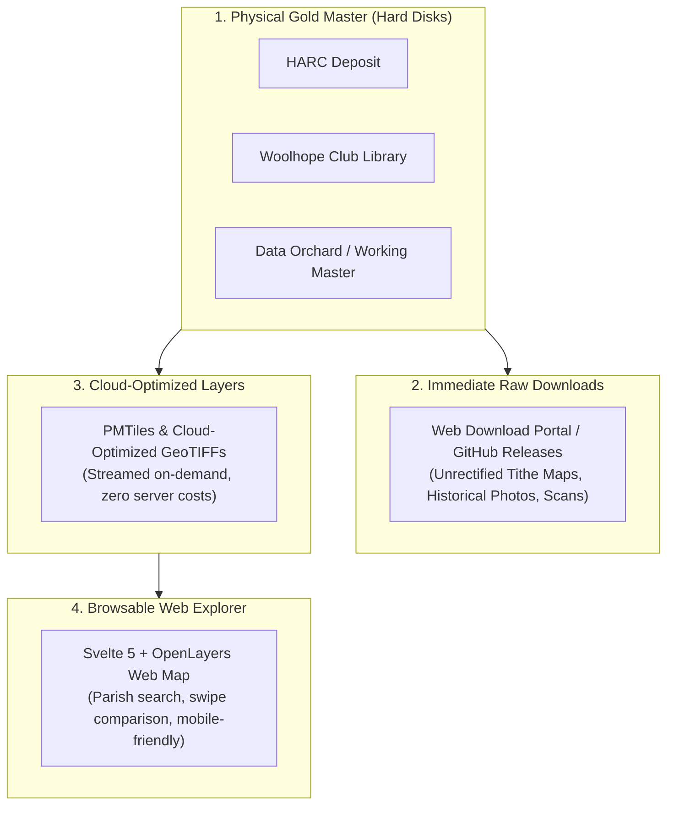
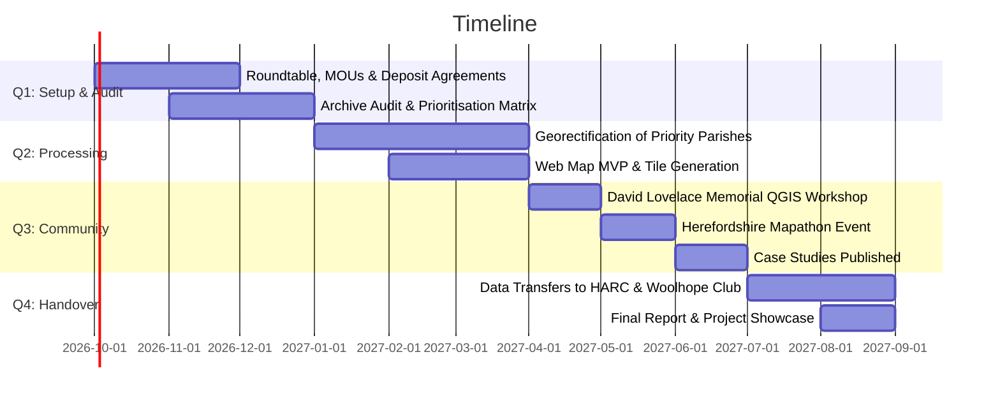

# The David Lovelace Archive: Project Bid (Working Skeleton)

David Lovelace Archive Working Group (Lead: Data Orchard CIC)
2026-09-11

- [1. Summary & Core Purpose](#1-summary--core-purpose)
- [2. Context & The Archive](#2-context--the-archive)
- [3. Archive Mechanics: What Lives
  Where?](#3-archive-mechanics-what-lives-where)
- [4. Workstreams & Resource
  Estimates](#4-workstreams--resource-estimates)
- [5. Summary Resource & Budget
  Skeleton](#5-summary-resource--budget-skeleton)
- [6. 12-Month Timeline Overview](#6-12-month-timeline-overview)
- [7. Next Steps & How to Contribute](#7-next-steps--how-to-contribute)

> **Working Skeleton Document: Invitation for Partner Input**:  
> This is a working bid document following the stakeholder meeting on
> **11 September 2026**. Rather than presenting final answers, each
> section outlines key outputs, resource estimates, and **open
> questions** for partners to shape. Please add your comments, refine
> the numbers, or propose additions.

> _(Note: The previous detailed drafting notes and extended background
> have been archived for reference in a [Google
> Doc](https://docs.google.com/document/d/1gT74smAr4lVKA6g3SMpwjdAneqWZGB_mNcB4XVSpNvA/edit?tab=t.0).)_

---

## 1. Summary & Core Purpose

See the Google Doc for the previous introduction and context

Working assumption: the project will be structured around three core
workstreams:

1.  **WS1: Prioritisation & Liaison**: Auditing the collection, agreeing
    county priorities, and establishing long-term archival transfer
    agreements.
2.  **WS2: Georectification, Training & Mapathons**: Processing priority
    tithe maps and aerial photography into GIS layers, combined with
    hands-on QGIS workshops, a community Mapathon, volunteer upskilling,
    and real-world case studies (meadows, parklands, botany).
3.  **WS3: Web Platform & Hosting**: A browsable, searchable web map
    explorer (building on https://bosci.net/) and direct download portal
    designed for long-term sustainability with minimal ongoing hosting
    costs.

### Key Project Parameters

- **Lead Accountable Organisation**: **Data Orchard CIC**
  (Herefordshire-based social enterprise; grant applicant and financial
  administrator).
- **Timescale**: 12 months.
- **Estimated Resource**: ~40 paid person-days (budgeted at a standard
  placeholder rate of **£350/day**) plus partner in-kind time (~15–20
  days).
- **Dedicated Capital Hardware**: 1x high-performance mapping laptop
  workstation (~£2,200) homed in Herefordshire and 3x standard external
  hard disks (~£350) for institutional deposits.
- **Funding Target**: ~**£19,500 – £20,000** (aligned with the National
  Lottery Awards for All grant ceiling and local charitable trusts such
  as Brightspace Foundation).

> 💬 **Questions for Partners on the Summary**:

> 1.  What is the most compelling single sentence to describe this
>     project to a charity trustee or grant panel?
> 2.  Are there any critical high-level outcomes missing from this
>     three-part structure?

---

## 2. Context & The Archive

David Lovelace spent over 40 years painstakingly surveying,
photographing, mapping, and digitising the historical geography and
ecology of Herefordshire. Before he passed away on 5 May 2026, he
expressed a clear hope that his archive would be made freely available
to inspire and equip people across the county.

The digital collection contains around **2 terabytes** and includes:

- Scans of parish **tithe maps and apportionments**.
- Historic **aerial photography** (including RAF 1947 flights and
  wartime Luftwaffe coverage).
- The **LOWVP Veteran Tree Survey** and woodland continuity assessments.
- **Grassland and meadow surveys** recording botanical continuity.
- Historical landscape records, estate maps, and industrial heritage
  documentation.

**Scope Discipline**: To ensure successful delivery within 12 months,
the project will remain tightly focused on David Lovelace’s archive for
Herefordshire, while laying technical foundations that could be scaled
in future years.

> 💬 **Questions for Partners on Scope & Context**:

> 1.  Which specific parishes, landscapes, or themes (e.g. grasslands,
>     ancient trees, parish tithes) represent the highest immediate
>     priority for your organisation?
> 2.  Are there upcoming county initiatives or time-sensitive projects
>     (e.g. Local Nature Recovery Strategy milestones, parkland plans,
>     book publications) that this archive should align with?

---

## 3. Archive Mechanics: What Lives Where?

To keep the project transparent to both generalists and technical
partners, the archive will operate across four simple, complementary
tiers:

1.  **Permanent Physical Copies**: 3x standard rugged external hard
    disks deposited with Herefordshire Archive and Records Centre
    (HARC), the Woolhope Club library, and Data Orchard/technical team.
2.  **Immediate Raw Scans**: Following archivist advice (Rhys
    Griffiths), raw unrectified scans and photo collections will be made
    downloadable right away—avoiding delays while georeferencing takes
    place.
3.  **Cloud-Optimized Streaming Layers**: Processed maps converted to
    open PMTiles/COG formats that stream into web browsers without heavy
    downloads.
4.  **Public Web Explorer**: An intuitive, mobile-friendly web map
    (Svelte + OpenLayers) allowing generalists and parish councils to
    view historical layers overlaid on modern photography.

> 💬 **Questions for Partners on Mechanics**: 1. Are there specific
> deposit standards, cataloguing formats, or access restrictions HARC or
> the Woolhope Club require for the physical hard disks? 2. For land
> managers and ecologists: what formats do you find most useful for
> day-to-day work (e.g. QGIS layers, Shapefiles/GeoPackages, or simple
> PDF/web maps)?

---

## 4. Workstreams & Resource Estimates

### Workstream 1: Prioritisation, Stakeholder Liaison & Facilitation

- **Focus**: Audit the 2.4 TB archive, establish transfer agreements,
  and agree a transparent county prioritisation matrix to guide which
  maps are processed first.
- **Key Outputs**:
  - Archive audit inventory (identifying already-georeferenced vs. raw
    scans).
  - Prioritisation matrix and agreed shortlist of parishes for WS2.
  - Digital transfer agreements signed with HARC and the Woolhope Club.
- **Skills Required**: Project facilitation, stakeholder engagement,
  archival knowledge.
- **Estimated Resource**: **~10 person-days** (led by Data Orchard CIC /
  Madeleine Spinks, supported by Robin Lovelace and partner auditors).

> 💬 **Questions for WS1**: - How should we collectively balance
> competing priorities (e.g. ecological urgency vs. historical
> significance vs. public demand)? - Who from your organisation will be
> the primary point of contact for the audit?

---

### Workstream 2: Georectification, Training & Mapathons

- **Focus**: Digitising and georeferencing priority tithe maps and
  aerial photography into open GIS/web layers, coupled directly with
  hands-on volunteer upskilling, QGIS workshops, a collaborative
  community Mapathon in Hereford, and real-world case studies
  demonstrating practical impact.
- **Key Outputs**:
  - Georectified tithe map layers and aerial photo mosaics for priority
    parishes (PMTiles & Cloud-Optimized GeoTIFFs).
  - **The David Lovelace Memorial QGIS Workshop**: 1–2 day beginner
    course in Hereford for parish councils, naturalists, and local
    historians.
  - **Herefordshire Mapathon Event**: 1-day collaborative public mapping
    event to georeference maps, trace historic boundaries, and tag
    veteran trees.
  - Ground-truthed features and 3–4 published case studies
    (e.g. Wyescapes floodplain meadow recovery, Homme House parkland,
    county flora botany, lost industrial mills).
  - Open downloadable training packs and video guides.
- **Skills Required**: QGIS georeferencing, GDAL raster processing,
  historical map interpretation, field validation, training delivery,
  event facilitation.
- **Estimated Resource**:
  - People: **~23–25 person-days** (technical lead/mentor + mapping
    assistant + specialist ground-truthing + workshop facilitation).
  - Hardware & Events: **1x high-spec mapping laptop workstation** homed
    in Herefordshire (~£2,200) + workshop venue hire, catering, and
    materials (~£1,500).

> 💬 **Questions for WS2**: - Who among local partners and freelance
> data specialists is interested in paid georectification days, training
> delivery, or technical mentoring? - What existing spatial datasets
> (e.g. tree GPS points, reserve boundaries) can partners provide to
> speed up ground-truthing? - Which venue in Hereford (or countywide)
> would be most suitable and accessible for the QGIS workshop and
> Mapathon? - How can your organisation help promote these training
> events to your members, volunteers, and land manager networks? - How
> would partners like their case studies framed to best showcase the
> archive’s practical value?

---

### Workstream 3: Web Development

- **Focus**: Delivering an open, browsable map interface with parish
  search and direct download capabilities, engineered for near-zero
  ongoing maintenance costs.
- **Key Outputs**:
  - Fast web map interface (Svelte 5 + OpenLayers) with spatial
    filtering by parish and grid square.
  - Asset geolocation linking historical photos and survey documents to
    map coordinates.
  - Self-service download portal for raw and processed files.
  - Static hosting pipeline (Netlify / GitHub Pages) ensuring zero
    ongoing server rental.
- **Skills Required**: Frontend web development (TypeScript, Svelte,
  OpenLayers), static deployment pipelines, geospatial data formats.
- **Estimated Resource**: **~6 person-days** (lead developer + testing).
  Hosting budget: ~£200 (domain, DNS, tile storage buffer).

> 💬 **Questions for WS3**: - What specific search or map features would
> make this interface easiest for non-technical community members to
> use? It would be useful to provide answers that relate to what is
> currently hosted at https://bosci.net/ - Are there existing county
> websites (e.g. Woolhope Club, Herefordshire Tree Forum, Council
> portals) that should link directly into this map?

---

## 5. Summary Resource & Budget Skeleton

The proposed budget is structured to fit within the **£20,000
threshold** of grant programmes such as **National Lottery Awards for
All**, with potential seed or match funding from the **Brightspace
Foundation** and local charitable trusts.

| Category                     | Description                                                                                                                     |   Estimate (£)    |
| :--------------------------- | :------------------------------------------------------------------------------------------------------------------------------ | :---------------: |
| **Capital Hardware**         | Dedicated high-spec mapping laptop homed in Herefordshire (Data Orchard / volunteers)                                           |      £2,200       |
| **Physical Media**           | 3x standard rugged external hard disks (HARC, Woolhope Club, Data Orchard)                                                      |       £350        |
| **People’s Time**            | ~40 person-days @ **£350/day placeholder rate** across facilitation (WS1), georectification & training (WS2), and web dev (WS3) |      £14,000      |
| **Community Events**         | Venue hire, catering, and materials for 2-day QGIS workshop & 1-day Mapathon                                                    |      £1,500       |
| **Digital Hosting & Travel** | Domain registration (2 yrs), cloud tile buffer, travel for rural ground-truthing, contingency                                   |      £1,900       |
| **TOTAL TARGET**             | **Complete 12-Month Project Delivery**                                                                                          |   **~£19,950**    |
| _In-Kind Contributions_      | _Partner staff time, meeting rooms, and volunteer ground-truthing (~20 days equivalent)_                                        | _~£7,000 (match)_ |

> 💬 **Questions on the Budget**:

> 1.  Does the placeholder rate of **£350/day** align reasonably with
>     partner expectations and freelance rates?
> 2.  How much in-kind venue space, volunteer time, or equipment to help
>     strengthen our match funding?

---

## 6. 12-Month Timeline Overview

---

## 7. Next Steps & How to Contribute

To turn this working skeleton into a finalised funding application:

1.  **Review & Comment**: Please add your feedback, answer the prompt
    questions in each section, and flag any missing elements.
2.  **Confirm Partner Roles**: Let us know how many days (paid or
    in-kind) your organisation would like to commit.
3.  **Lead Organisation Next Steps**: Data Orchard CIC will coordinate
    comments, formalise grant administration requirements, and draft the
    application for Brightspace Foundation / Awards for All.
4.  **Initial Data Dispatch**: Robin Lovelace to prepare the 3x external
    hard drives with the core archive for transfer to HARC, Woolhope
    Club, and Data Orchard.

---

### Working Group Contacts & Key Contributors

- **Data Orchard CIC**: Madeleine Spinks (Project Facilitation &
  Accountable Organisation Lead)
- **Technical & Academic Lead**: Robin Lovelace (University of Leeds /
  FOSS4LH)
- **Data & Community Specialist**: Ben Proctor
- **Woolhope Naturalists’ Field Club**: Rachel Jenkins (Convenor), Chris
  Milton (Secretary/Treasurer)
- **Herefordshire Archive & Records Centre (HARC)**: Rhys Griffiths
- **Herefordshire Meadows / FWAG**: Caroline Hanks
- **Ancient Tree Forum / Tree Forum**: Jerry Ross
- **Botanical Recording (BSBI VC36)**: Stuart Hedley
- **Historic Parkland & Estate Heritage**: Charlie H (Homme House)
- **Herefordshire Wildlife Trust**: Saul Herbert
- **Brightspace Foundation / Funding Liaison**: Dave Marshall
- **Community GIS Volunteer Network**: Nic Howes
