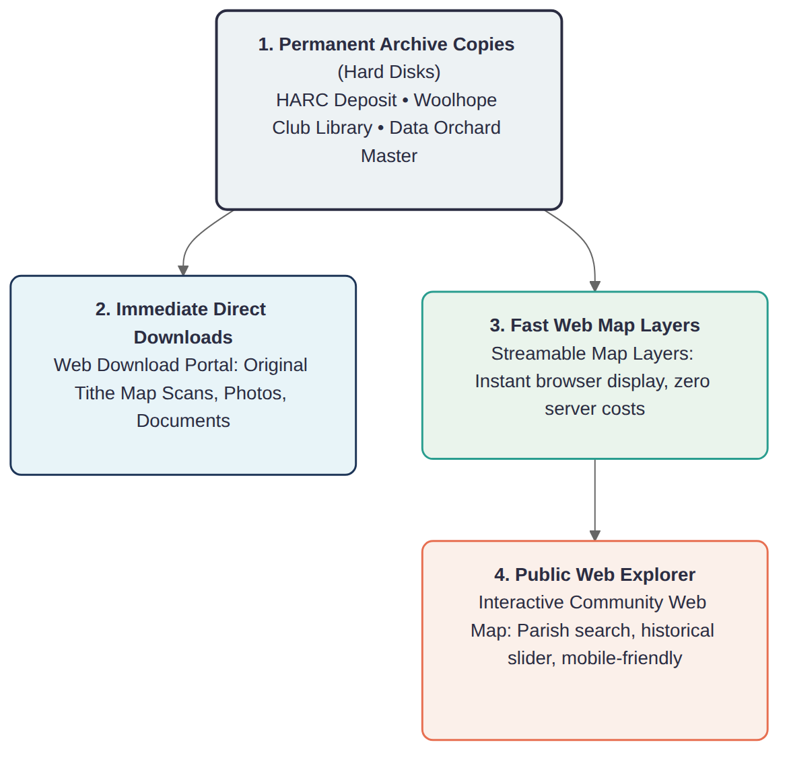
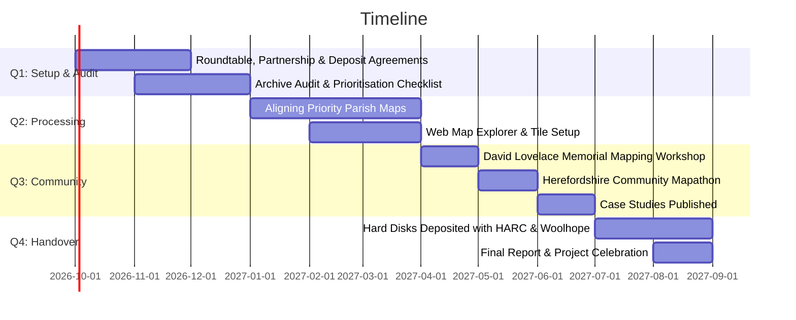

> Working Skeleton Document: Invitation for Partner Input:  
> This is a working bid document following the stakeholder meeting on 11 September 2026. Rather than presenting final answers, each section outlines key outputs, resource estimates, and open questions for partners to shape. Please add your comments, refine the numbers, or propose additions.

> *(Note: The previous detailed drafting notes and extended background have been archived for reference in a [Google Doc](https://docs.google.com/document/d/1gT74smAr4lVKA6g3SMpwjdAneqWZGB_mNcB4XVSpNvA/edit?tab=t.0).)*

---

## 1. Project Summary

See the Google Doc for the previous introduction and context.

The project has three workstreams:

1. WS1: Prioritisation & Liaison: Auditing the archive, agreeing county priorities, and setting up long-term deposit agreements with local heritage repositories.
2. WS2: Historic Map Alignment, Training & Mapathons: Digitising and aligning priority parish tithe maps and historic aerial photos with modern coordinates, paired with volunteer training, community mapping workshops in Hereford, and local case studies (meadows, parklands, veteran trees, botany).
3. WS3: Web Map & Public Downloads: An easy-to-use, searchable online map (building on https://bosci.net/) and direct download portal designed for permanent access with no ongoing server fees.

### Key Project Parameters
- Lead Accountable Organisation: Data Orchard CIC (Community Interest Company; Herefordshire-based social enterprise, grant applicant, and financial administrator).
- Timescale: 12 months.
- Estimated Resource: ~40 paid person-days (budgeted at a standard placeholder rate of £350/day) plus partner in-kind time (~15–20 days).
- Dedicated Capital Hardware: 1x dedicated mapping laptop workstation (~£2,200) homed in Herefordshire and 3 external hard drives (~£350) for institutional archive deposits.
- Funding Target: ~£19,500 – £20,000 (aligned with the National Lottery Awards for All grant ceiling and local charitable trusts such as Brightspace Foundation).

> Questions for Partners on the Summary:

> 1. What is the best single sentence to describe this project to a charity trustee or grant panel?
> 2. Are there any key outcomes missing from this three-part structure?

---

## 2. The Archive

David Lovelace spent over 40 years surveying, photographing, mapping, and digitising the historical landscape and ecology of Herefordshire. Before he passed away on 5 May 2026, he expressed a clear wish that his archive be made freely available to inspire and equip people across the county.

The digital collection contains around 2 terabytes of material, including:

- Scans of parish tithe maps and apportionments.
- Historic aerial photography (including Royal Air Force (RAF) 1947 flights and wartime aerial surveys).
- The Landscape Origins of the Wye Valley Project (LOWVP) Veteran Tree Survey and ancient woodland continuity studies.
- Traditional grassland and meadow surveys recording botanical diversity.
- Historical landscape records, estate maps, and industrial archaeology records.

Project Scope: To stay on track within 12 months, the work focuses strictly on David Lovelace's archive for Herefordshire, while building open foundations that can be expanded in future years.

> Questions for Partners on Scope & Context:

> 1. Which specific parishes, landscapes, or themes (e.g. traditional meadows, ancient trees, parish tithes) represent the highest immediate priority for your organisation?
> 2. Are there upcoming county initiatives or time-sensitive projects (e.g. Local Nature Recovery Strategy milestones, parkland restorations, forthcoming publications) that this archive should support?

---

## 3. Archive Structure: What Lives Where?

The archive operates across four levels:

1. Permanent Archival Hard Disks: 3 external hard drives deposited with Herefordshire Archive and Records Centre (HARC), the Woolhope Club library, and Data Orchard.
2. Immediate Direct Downloads: Following archivist advice (Rhys Griffiths), original scans and photos will be downloadable immediately while map processing is underway.
3. Fast Web Map Layers: Processed historic maps converted into modern web layers that load smoothly without downloading massive files.
4. Public Web Map Explorer: An intuitive, mobile-friendly online map allowing parish councils, schools, and researchers to view historic maps overlaid on modern aerial photography.

> Questions for Partners on Archive Structure:
> 1. Are there specific deposit standards, cataloguing formats, or access guidelines HARC or the Woolhope Club require for the physical hard disks?
> 2. For land managers and ecologists: what map formats do you find most practical for everyday work (e.g. desktop GIS mapping layers such as QGIS, data spreadsheets, or simple web maps)?

---

## 4. Workstreams

### Workstream 1: Prioritisation, Stakeholder Liaison & Facilitation

- Focus: Audit the 2.4 TB archive, establish formal deposit agreements, and agree a county prioritisation checklist to decide which parish maps are processed first.
- Key Outputs:
  - Archive audit inventory: cataloguing aligned maps versus raw scans.
  - Prioritisation checklist: an agreed shortlist of priority parishes for WS2.
  - Digital transfer agreements: signed partnerships with HARC and the Woolhope Club.
- Skills Required: Project facilitation, stakeholder engagement, archival cataloguing.
- Estimated Resource: ~10 person-days (led by Data Orchard CIC / Madeleine Spinks, supported by Robin Lovelace and partner reviewers).

> Questions for WS1:
> - How should we balance competing priorities (e.g. urgent habitat recovery vs. historical rarity vs. local community demand)?
> - Who from your organisation will be the primary point of contact for the audit?

---

### Workstream 2: Historic Map Alignment, Training & Mapathons

- Focus: Digitising and aligning priority tithe maps and aerial photos with modern coordinates, combined directly with practical volunteer training, community mapping workshops in Hereford, and local case studies.
- Key Outputs:
  - Aligned historic map and aerial photo layers for priority parishes, ready for online viewing and desktop mapping.
  - The David Lovelace Memorial Mapping Workshop: A 1–2 day beginner course in Hereford for parish councils, naturalists, and local historians (using free QGIS software).
  - Herefordshire Mapathon: A 1-day collaborative community event to align historic maps, trace old field boundaries, and record veteran trees.
  - Field-checked case studies: 3–4 published examples demonstrating practical value (e.g. Wyescapes floodplain meadow recovery, Homme House historic parkland, county botanical recording, lost industrial mills).
  - Open training packs and step-by-step video guides.
- Skills Required: Digital map alignment, historic landscape interpretation, field ground-truthing, training delivery, and event facilitation.
- Estimated Resource:
  - People: ~23–25 person-days (technical lead/mentor, mapping assistant, field surveyor, workshop facilitator).
  - Hardware & Events: 1x dedicated mapping laptop homed in Herefordshire (~£2,200) plus workshop venue hire, catering, and materials (~£1,500).

> Questions for WS2:
> - Who among local partners and freelance specialists is interested in paid mapping work, training delivery, or mentoring?
> - What existing records (e.g. tree GPS points, nature reserve boundaries) can partners provide to speed up field checking?
> - Which venue in Hereford (or countywide) would be most welcoming and accessible for the workshop and Mapathon?
> - How can your organisation help publicise these training events to your members, volunteers, and landowner networks?
> - How would partners like their case studies framed to best demonstrate the archive's practical value?

---

### Workstream 3: Web Development & Public Access

- Focus: Delivering a fast, easy-to-use online map explorer with parish search and direct downloads, designed to run permanently with no ongoing server rental fees.
- Key Outputs:
  - Interactive community web map with parish search, map layer comparison sliders, and grid reference lookups.
  - Searchable links connecting historic photographs and survey documents directly to map locations.
  - Self-service download portal for original scans and processed map layers.
  - Permanent web hosting setup running at virtually zero cost.
- Skills Required: Web development, map user interface design, and open data publishing.
- Estimated Resource: ~6 person-days (lead developer and community user testing). Digital costs: ~£200 (domain registration, DNS, web hosting storage buffer).

> Questions for WS3:
> - What specific search options or map tools would make this interface easiest for non-specialists to navigate? (Suggestions in relation to what is currently hosted at https://bosci.net/ are welcome.)
> - Are there existing county websites (e.g. Woolhope Club, Herefordshire Tree Forum, Council portals) that should link directly into this map?

---

## 5. Budget

The budget fits the £20,000 ceiling for grant programmes like National Lottery Awards for All, with potential seed or match funding from the Brightspace Foundation and local charitable trusts.

| Category | Description | Estimate (£) |
| :--- | :--- | :---: |
| Capital Hardware | Dedicated high-spec mapping laptop homed in Herefordshire (Data Orchard / volunteers) | £2,200 |
| Physical Media | 3 external hard drives (HARC, Woolhope Club, Data Orchard) | £350 |
| People's Time | ~40 person-days @ £350/day placeholder rate across facilitation (WS1), map alignment & training (WS2), and web development (WS3) | £14,000 |
| Community Events | Venue hire, catering, and materials for 2-day mapping workshop & 1-day Mapathon | £1,500 |
| Digital Hosting & Travel | Domain registration (2 yrs), online map storage buffer, travel for rural field checking, and contingency | £1,900 |
| Total Budget (12 Months) | Complete 12-Month Project Delivery | £19,950 |
| *In-Kind Contributions* | *Partner staff time, meeting rooms, and volunteer field checking (~20 days equivalent)* | *~£7,000 (match)* |

> Questions on the Budget:

> 1. Does the placeholder rate of £350/day align reasonably with partner expectations and freelance rates?
> 2. What in-kind venue space, volunteer time, or equipment can your organisation offer to help strengthen our match funding?

---

## 6. 12-Month Timeline Overview

---

## 7. Next Steps

Next steps:

1. Review & Comment: Please add your feedback, answer the prompt questions in each section, and flag any missing elements.
2. Confirm Partner Roles: Let us know how many days (paid or in-kind) your organisation would like to commit.
3. Lead Organisation Next Steps: Data Orchard CIC will coordinate comments, formalise grant administration requirements, and draft the application for Brightspace Foundation / Awards for All.
4. Initial Data Dispatch: Robin Lovelace to prepare the 3 external hard drives with the core archive for transfer to HARC, Woolhope Club, and Data Orchard.

---

### Working Group Contacts & Key Contributors
- Data Orchard CIC: Madeleine Spinks (Project Facilitation & Accountable Organisation Lead)
- Technical & Academic Lead: Robin Lovelace (University of Leeds / FOSS4LH)
- Data & Community Specialist: Ben Proctor
- Woolhope Naturalists' Field Club: Rachel Jenkins (Convenor), Chris Milton (Secretary/Treasurer)
- Herefordshire Archive & Records Centre (HARC): Rhys Griffiths
- Herefordshire Meadows / FWAG (Farming & Wildlife Advisory Group): Caroline Hanks
- Ancient Tree Forum / Tree Forum: Jerry Ross
- Botanical Recording (BSBI - Botanical Society of Britain & Ireland, Vice-County 36 Herefordshire): Stuart Hedley
- Historic Parkland & Estate Heritage: Charlie H (Homme House)
- Herefordshire Wildlife Trust: Saul Herbert
- Brightspace Foundation / Funding Liaison: Dave Marshall
- Community GIS Volunteer Network: Nic Howes
