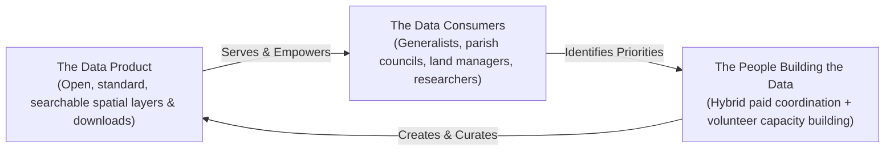
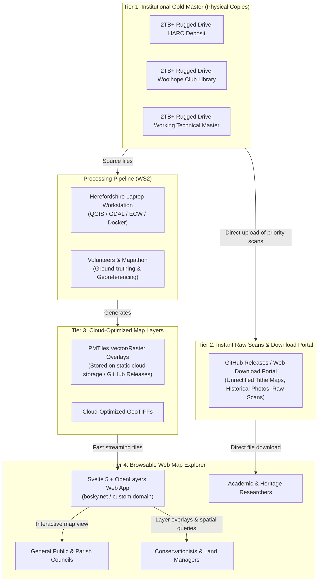
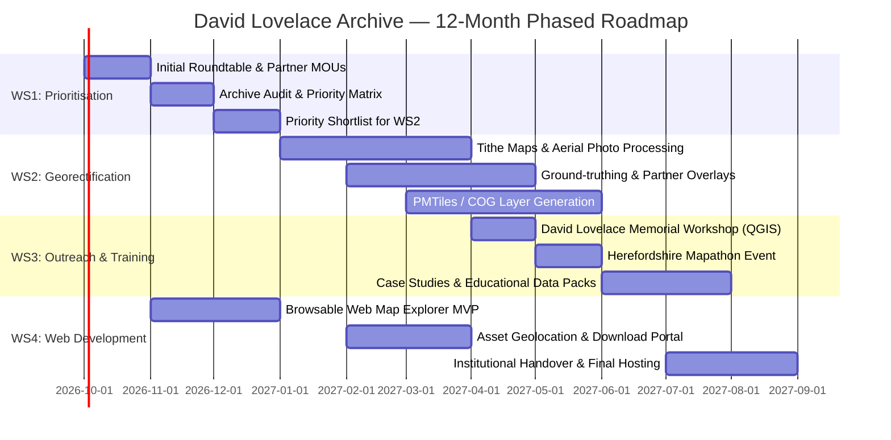
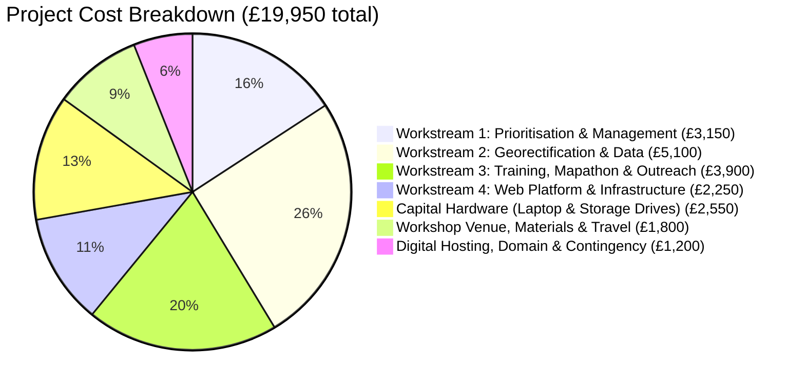

> [!NOTE]
> **Document Status**: Evolving placeholder bid document following the multi-stakeholder roundtable on **11 September 2026**. This document outlines the fundamental vision, workstreams, skills requirements, estimated resources (people's time, computer hardware, hosting), data architecture, and initial budget. It is designed to be co-developed asynchronously by project partners prior to formal submission to funding bodies.

---

## 1. Executive Summary

This project will unlock the extraordinary archive assembled over four decades by the late **David Lovelace (1948–2026)**, transforming a private collection into an open, accessible, and community-driven digital resource for the county of Herefordshire.

Before his passing on 5 May 2026, David asked his son Robin and close colleagues to ensure that his life’s work was not lost, but made freely available for the benefit of Herefordshire's conservation, heritage, and research communities. The collection represents the most comprehensive non-governmental spatial record of Herefordshire’s landscape, trees, meadows, woods, and historical geography in existence.

The project is structured around **four complementary workstreams**:

1. **Workstream 1: Prioritisation, Stakeholder Liaison & Project Facilitation** — Convening county partners to audit the archive, establish transfer agreements, and agree a collective prioritisation matrix to guide data processing.
2. **Workstream 2: Georectification of Historic Maps and Aerial Photography** — Digitising and georeferencing priority tithe maps, 1947 RAF aerial photography, and historic surveys through a hybrid model of technical mentoring and volunteer upskilling.
3. **Workstream 3: Outreach, QGIS Training, Mapathons & Case Studies** — Delivering hands-on community training in open-source GIS (QGIS), running collaborative "Mapathons", and showcasing real-world case studies in meadow restoration, parkland heritage, and botany.
4. **Workstream 4: Web Development, Asset Geolocation & Data Infrastructure** — Deploying a fast, accessible, browsable web map and download portal with zero-to-low ongoing hosting costs, backed by institutional deposits on physical media.

**Key Parameters**:
- **Accountable Organisation**: **Data Orchard CIC** (Herefordshire-based social enterprise; lead applicant and grant administrator).
- **Project Duration**: 12 months.
- **Day Rates**: Standard placeholder rate of **£350/day** across all workstreams.
- **Hardware & Capital Media**: Dedicated high-performance mapping laptop workstation (~£2,200) homed in Herefordshire and 3x standard external hard disks (~£350) for archival preservation and institutional deposits.
- **Estimated Resource**: 41 paid person-days alongside substantial in-kind stakeholder contributions (22 days).
- **Target Budget Envelope**: **£19,950** (comprising capital hardware, professional facilitation/technical time, community training workshops, and initial hosting).
- **Target Funders**: Brightspace Foundation, National Lottery Awards for All (£20k threshold), and local Herefordshire charitable trusts.

---

## 2. Context & The David Lovelace Archive

### 2.1 The Legacy of David Lovelace (1948–2026)
David Lovelace was a pioneering landscape ecologist, historical geographer, cartographer, and open-source champion. For more than forty years, living and working in Herefordshire, David painstakingly surveyed, photographed, mapped, and digitised the county's natural and built environment. Combining formidable historical scholarship with cutting-edge open-source geospatial technology (GDAL, QGIS, Linux), he produced datasets of unparalleled spatial accuracy and historical depth.

His work underpinned landmark county initiatives, including floodplain meadow restoration along the River Wye (Wyescapes), ancient woodland surveys, parkland restoration schemes, and veteran tree recording. David was also a patient and inspirational teacher who believed passionately that spatial data should be freely available to all, not locked behind commercial paywalls or institutional red tape.

### 2.2 Contents and Scale of the Archive
The digital archive spans over **2.4 terabytes** (with physical scans and working libraries extending toward 2.8 TB), comprising:
- **Historic Tithe Maps**: High-resolution scans covering dozens of Herefordshire parishes, many with accompanying apportionments.
- **Aerial Photography**: Complete and partial historic aerial surveys, notably the post-war RAF 1947 flights and 1940s Luftwaffe aerial photography, providing an invaluable baseline of the landscape prior to intensive post-war agricultural change.
- **LOWVP Veteran Tree Survey**: Comprehensive geolocated surveys of thousands of veteran, ancient, and notable trees across the county.
- **Grassland & Meadow Continuity Records**: Detailed field-by-field assessments of unimproved and semi-improved grassland continuity.
- **Botanical & Habitat Records**: Decades of botanical field observations (vice-county VC36), including historic distributions of rare and declining species (e.g. wild juniper on Dinmore Hill).
- **Historical Landscape & Built Heritage Data**: Scanned estate maps, enclosure awards, LiDAR digital terrain models, and records of lost industrial sites, watermills, and parklands.

---

## 3. Project Philosophy: The Triad Model

Following discussions at the 11 September 2026 stakeholder meeting, the project adopts a three-part conceptual framework proposed by Ben Proctor:

1. **The Data Product**: Creating well-documented, standard, open-format spatial data assets (Cloud-Optimized GeoTIFFs, PMTiles, GeoPackage, and open web layers) that can be easily viewed in a browser or loaded into standard GIS tools without proprietary software.
2. **The People Building the Data**: Combining paid professional facilitation and technical mentoring with enthusiastic volunteer and partner participation. Rather than relying solely on unpaid goodwill, modest funding supports key coordinators who train, mentor, and empower community volunteers.
3. **The Data Consumers**: Catering across the technical spectrum—from non-technical generalists and parish councillors who need an intuitive, clickable map interface, to land managers and academic researchers who need raw GIS vector boundaries and high-resolution rasters.

---

## 4. The Archive "Mechanics": Data Architecture & Storage Strategy

A critical question raised during the stakeholder meeting (by Rachel Jenkins and Rhys Griffiths) is: **How does the archive work mechanically? What lives on the internet, what lives on hard drives, and how does data flow safely between them?**

The project employs a **four-tiered "belt-and-braces" architecture** ensuring both open public access and permanent institutional preservation:

### 4.1 Storage & Access Tiers

| Tier | Component | Description & Storage Location | Access Method | Cost Implication |
| :--- | :--- | :--- | :--- | :--- |
| **Tier 1** | **Institutional Gold Master** | Full raw archive (~2.4–2.8 TB) duplicated onto 3x rugged external USB drives / SSDs deposited with HARC, Woolhope Club, and the local technical lead. | Physical custody; permanent archival security; independent of cloud services. | One-off capital hardware (~£350). |
| **Tier 2** | **Immediate Raw Scans & Download Portal** | High-resolution parish tithe map scans, RAF aerial survey sheets, and photo bundles made downloadable immediately (Rhys Griffiths' phased approach). | Direct web download via GitHub Releases / Bosky download portal. | Zero ongoing cost (using open repository release storage). |
| **Tier 3** | **Cloud-Optimized Geospatial Layers** | Processed maps converted into modern cloud formats (PMTiles for vector/raster tiles, COGs for imagery). Streamed dynamically by bounding box. | Consumed directly by web maps and QGIS via URL without downloading multi-gigabyte files. | Negligible cloud storage / zero-egress cost. |
| **Tier 4** | **Browsable Web Map Explorer** | Fast, mobile-responsive web application built with Svelte 5 and OpenLayers. Features parish search, opacity sliders, and layer toggles. | Web browser on desktop, tablet, or smartphone (no installation required). | Hosted statically on Netlify / GitHub Pages (free tier). |

### 4.2 Separating Capital Investment from Ongoing Maintenance
As noted by Dave Marshall and Ben Proctor, funding bids must distinguish between:
1. **Up-front Capital Investment**: Computing hardware (laptop and high-capacity storage drives) and project establishment.
2. **Short-Term Revenue**: People's time to facilitate, train, georectify, and develop the web platform over the 12-month project.
3. **Ongoing Medium-Term Maintenance**: Low-cost hosting and periodic curation. Because the architecture relies on static serverless hosting (PMTiles and GitHub Releases/Netlify), recurring costs are virtually zero (~£30–£50/year for domain and DNS). The Brightspace Foundation has expressed openness to discussing ongoing support and underwrite within its charitable remit.

---

## 5. Case Studies: Grounding the Archive in Real Landscapes

To ensure the project speaks to generalists, community members, and charity trustees (as highlighted by Rachel Jenkins and Charlie H), the work will be anchored in four tangible, real-world case studies:

### Case Study 1: Floodplain Meadow Recovery along the River Wye (Wyescapes)
- **Stakeholder Lead**: Caroline Hanks (Herefordshire Meadows / FWAG / Wye Valley National Landscape).
- **The Challenge**: Identifying high-potential sites for species-rich floodplain meadow restoration without wasting resources on fields ploughed continuously for decades.
- **Archival Contribution**: David Lovelace previously provided georectified historic mapping showing fields along the Wye and Lugg with uninterrupted grassland continuity. This historical evidence established the foundation for Defra-funded Landscape Recovery bids and farmer cluster agreements.
- **Project Output**: Publish a dedicated grassland continuity layer and methodology guide showing how historic maps de-risk ecological restoration.

### Case Study 2: Registered Parkland & Ancient Tree Restoration at Homme House, Much Marcle
- **Stakeholder Lead**: Charlie H (Homme House) in partnership with Historic England and Natural England.
- **The Challenge**: Formulating a parkland restoration management plan that respects 18th-century Capability Brown designs while safeguarding veteran trees and biodiversity.
- **Archival Contribution**: Homme House already holds extensive modern veteran tree survey coordinates. Cross-referencing these with David's georectified estate maps, tithe surveys, and historic aerial photos will trace tree loss, field boundary change, and wood-pasture continuity over 180 years.
- **Project Output**: A replicable case study showing how private estates and community heritage groups can use the archive for conservation management plans.

### Case Study 3: Botanical Continuity & The County Flora
- **Stakeholder Lead**: Stuart Hedley (Herefordshire Plant Recorder, BSBI VC36).
- **The Challenge**: Compiling a comprehensive County Flora over the coming decade requires understanding historical plant distributions and ecological loss.
- **Archival Contribution**: David's archive contains detailed botanical survey notes and habitat assessments, such as his meticulous documentation of the last wild native juniper (*Juniperus communis*) on Dinmore Hill and local oral histories of its decline.
- **Project Output**: Curated botanical datasets integrated into VC36 recording networks and made accessible for field botanists through QGIS mobile capture.

### Case Study 4: Built Heritage & Industrial Archaeology
- **Stakeholder Lead**: Nic Howes, Chris Milton, and the Woolhope Naturalists' Field Club.
- **The Challenge**: Locating and documenting lost historic structures, watermills, and early industrial heritage across Herefordshire.
- **Archival Contribution**: High-resolution scanned maps combined with modern LiDAR terrain data allow precise pinpointing of forgotten sites, such as the rediscovery of White Marsh Mill in Hereford.
- **Project Output**: Interactive historical mapping packs for local history societies and schools.

---

## 6. Detailed Workstream Specifications

Following the guidance from Ben Proctor and Madeleine Spinks, each workstream defines the **required skills**, **estimated days**, **hardware/hosting needs**, and **roles**.

---

### Workstream 1: Prioritisation, Stakeholder Liaison & Project Facilitation

#### Objectives & Scope
Without disciplined prioritisation, a 2.4 TB archive can overwhelm project resources. Workstream 1 establishes clear governance, conducts a structured archive audit, and develops a consensus-driven prioritisation matrix to determine which maps and datasets are processed first.

#### Key Activities
1. **Stakeholder Roundtable & Setup**: Convene key county organisations (HARC, Woolhope Club, Herefordshire Meadows, ATF, HWT, Data Orchard) to confirm representation and data needs.
2. **Structured Archive Audit**: Inventory the raw collection, identifying already-georectified assets (ECWs/GeoTIFFs) versus unrectified scans, categorising by parish and thematic interest.
3. **Prioritisation Matrix**: Develop a transparent scoring matrix (demand, ecological urgency, heritage significance, technical readiness) to select priority parishes for WS2.
4. **Archival Transfer Agreements**: Agree formal protocols for depositing gold-master digital copies with HARC and the Woolhope Club library.

#### Skills Required
- Project management and community-led facilitation.
- Familiarity with Herefordshire community networks, conservation bodies, and local history organisations.
- Archival cataloguing and metadata standards.

#### Resource Allocation
- **Project Facilitator / Lead** (Data Orchard CIC / Madeleine Spinks): 4 days.
- **Project Co-Lead / Archival Liaison** (Robin Lovelace): 2 days.
- **Domain Specialists & Auditors** (Stuart Hedley, Caroline Hanks, Jerry Ross, Saul Herbert): 4 days total (paid/in-kind mix).
- **Institutional Partners** (Rhys Griffiths / HARC, Rachel Jenkins & Chris Milton / Woolhope Club): 4 days (in-kind).
- **Total Workstream 1 Effort**: **6 paid days + 8 in-kind days**.

#### Hardware & Infrastructure Needs
- 3x 2TB external hard drives for master transfers (~£350).
- Shared collaborative workspace (Google Drive / GitHub) for asynchronous review.

---

### Workstream 2: Georectification of Historic Maps and Aerial Photography

#### Objectives & Scope
Transform scanned historical raster maps and aerial photos into accurate, spatially enabled GIS layers ready for web viewing and conservation analysis. This workstream operates as a **capacity-building partnership**: paid technical experts process complex layers while mentoring local practitioners and volunteers.

#### Key Activities
1. **Priority Tithe Map Georectification**: Georeference priority parishes identified in WS1 (e.g., Kings Caple, Clifford, Breinton, Much Marcle, and Wye Valley parishes).
2. **Aerial Photography Processing**: Georectify RAF 1947 and wartime Luftwaffe aerial survey tiles covering priority restoration zones.
3. **QGIS & GDAL Processing**: Transform raw rasters into open Cloud-Optimized GeoTIFFs (COGs) and PMTiles pyramids using modern compression (Deflate/ZSTD).
4. **Ground-Truthing & Partner Validation**: Cross-reference historical features against modern aerial imagery, Ancient Tree Inventory records, and field boundaries with partner organisations.
5. **Volunteer Skill Sharing**: Run pair-working sessions between technical leads and local volunteers to demystify the georectification process.

#### Skills Required
- Advanced GIS and cartographic georeferencing (QGIS Georeferencer, ground control points, spline/polynomial transformations).
- Raster data processing using GDAL, Docker, and command-line spatial tools.
- Historical map interpretation (tithe symbols, field names, historical land use).
- Botanical and arboricultural field knowledge for ground-truthing.

#### Resource Allocation
- **Technical Lead / Georectification Mentor** (Robin Lovelace / Local Data Specialist): 5 days.
- **Local Data Practitioner / Mapping Assistant** (Ben Proctor / Data Orchard): 4 days.
- **Ground-Truthing Specialists** (Ancient Tree Forum 2 days, Herefordshire Meadows 2 days, Homme House 1 day in-kind, HWT 1 day): 5 paid days + 1 in-kind day.
- **Total Workstream 2 Effort**: **14 paid days + 1 in-kind day**.

#### Hardware & Infrastructure Needs
- **Dedicated High-Performance Mapping Laptop** homed in Herefordshire (allocated to Data Orchard / trained mapping volunteers): 32GB+ RAM, fast NVMe storage, dedicated GPU (~£2,000).
- QGIS (open-source) + Docker with GDAL ECW drivers.

---

### Workstream 3: Outreach, QGIS Training, Mapathons & Case Studies

#### Objectives & Scope
Ensure the archive is actively used across Herefordshire by training local people in open-source mapping, fostering academic collaboration, and demonstrating value through published case studies.

#### Key Activities
1. **The David Lovelace Memorial QGIS Workshop**: A 2-day practical training workshop in Hereford for beginners and intermediate users (parish councils, naturalists, landowners, local historians). Topics: installing QGIS, loading georectified archive layers, overlaying modern boundaries, field digitization.
2. **The Herefordshire Historic Mapathon**: A public 1-day collaborative mapping event (hosted in partnership with NMITE / Hereford College or community venue) where volunteers learn to georeference maps, trace historic orchard boundaries, and tag veteran trees.
3. **Case Study Documentation**: Produce four illustrated case study reports (Meadows, Homme House, Botany, Built Heritage) published on the archive website and presented at community events.
4. **Academic Research Initiation**: Partner with the University of Leeds Institute for Transport Studies (ITS) and regional geography departments to scope academic research using the archive (e.g. longitudinal hedgerow loss, 150-year woodland continuity).
5. **Open Educational Data Packs**: Package sample georeferenced maps, boundary shapefiles, and short video tutorials for free download.

#### Skills Required
- Training curriculum design and technical teaching for non-specialist adult learners.
- Event organisation and public workshop facilitation.
- Science communication and written case study curation.
- Academic liaison and research scoping.

#### Resource Allocation
- **Training Lead & Workshop Facilitator** (Robin Lovelace): 3 days.
- **Community Outreach & Event Facilitator** (Data Orchard / Madeleine Spinks): 3 days.
- **Case Study Contributors** (Herefordshire Meadows 1 day, ATF 1 day, Homme House in-kind): 2 paid days + 1 in-kind day.
- **Local Volunteer Support & Mentoring** (Nic Howes, Jerry Ross): In-kind.
- **Total Workstream 3 Effort**: **8 paid days + 3 in-kind days**.

#### Hardware & Infrastructure Needs
- Workshop venue hire and projection facilities in Hereford (~£600).
- Training materials, printed data packs, and catering (~£400).
- Dedicated training laptops (leveraging the project laptop plus BYOD / partner devices).

---

### Workstream 4: Web Development, Asset Geolocation & Data Infrastructure

#### Objectives & Scope
Build and deploy a permanent, accessible, and fast web map application allowing anyone to explore the archive, search by parish or grid reference, overlay historical maps against modern aerial photography, and download raw assets.

#### Key Activities
1. **Web Map Interface (Svelte 5 + OpenLayers)**: Develop and refine the interactive web map (`bosky.net` / `archive.foss4lh.org`) featuring:
   - Side-by-side / swipe map comparison (historic tithe map vs. 1947 RAF vs. modern aerial).
   - Parish search, grid square filtering, and thematic toggles (trees, meadows, woods, mills).
   - Clean, lightweight UI accessible to non-technical users on tablets and mobile devices.
2. **Asset Geolocation Pipeline**: Spatially index historical photographs and document scans, enabling users to click on a map location and view matching archival photos and notes.
3. **Raw Asset Download Portal**: Deploy a straightforward download directory (Rhys Griffiths' phased approach) so users can download raw, uncompressed tithe maps and scans without submitting manual requests.
4. **Sustainable, Zero-Cost Hosting Architecture**: Configure static hosting on Netlify / GitHub Pages with PMTiles served from open cloud releases, eliminating ongoing server rental costs.
5. **Documentation & Open Source Handover**: Publish all code openly under the MIT / GPL license on GitHub (`foss4lh/david-lovelace-archive`) with clear deployment instructions.

#### Skills Required
- Modern web development (TypeScript, Svelte 5 runes, Vite, OpenLayers).
- Geospatial web optimization (PMTiles, vector tiles, client-side reprojection).
- Static site deployment, CI/CD pipelines, and GitHub Actions automation.
- UX/UI design tailored for community accessibility.

#### Resource Allocation
- **Lead Web Developer & System Architect** (Robin Lovelace): 4 days.
- **Data Pipeline & UI Reviewer** (Ben Proctor / Data Orchard): 2 days.
- **User Acceptance Testing & Feedback** (Woolhope Club, HARC, General Public): In-kind.
- **Total Workstream 4 Effort**: **6 paid days + 2 in-kind days**.

#### Hardware & Infrastructure Needs
- Domain registration and DNS management for 2 years (~£50).
- Static web hosting via Netlify / GitHub Pages (free open-source tier).
- Cloud storage buffer for tile hosting (~£100).

---

## 7. Resource Summary & Proposed Budget

### 7.1 Summary of Person-Days by Workstream

| Person / Role | Organisation | WS1 (Prioritise) | WS2 (Georectify) | WS3 (Outreach) | WS4 (Web Dev) | Total Paid | In-Kind | Notes |
| :--- | :--- | :---: | :---: | :---: | :---: | :---: | :---: | :--- |
| **Project Facilitator / Manager** | Data Orchard CIC | 4 | 2 | 3 | 0 | **9** | — | Overall facilitation, community liaison, event coordination |
| **Technical Lead & Web Developer** | Robin Lovelace (Leeds) | 2 | 3 | 3 | 4 | **12** | 3 | Technical mentoring, QGIS training, web development |
| **Local Data Specialist / Mapper** | Freelance / Ben Proctor | 0 | 4 | 0 | 2 | **6** | 2 | Georectification, pipeline assistance, data infrastructure |
| **Botanical Specialist** | Stuart Hedley (BSBI VC36) | 2 | 1 | 1 | 0 | **4** | 1 | Archive botanical audit, flora integration, case study |
| **Ancient Tree Specialist** | Ancient Tree Forum / Jerry Ross | 1 | 2 | 1 | 0 | **4** | 1 | Tree survey audit, ATI cross-referencing, workshop support |
| **Meadow & Grassland Specialist** | Herefordshire Meadows / FWAG | 1 | 2 | 1 | 0 | **4** | 1 | Grassland continuity, Wyescapes case study, workshop co-host |
| **Ecological Conservation Lead** | Herefordshire Wildlife Trust | 1 | 1 | 0 | 0 | **2** | 1 | Nature reserve overlays, LNRS alignment |
| **Parkland Heritage Partner** | Homme House (Charlie H) | 0 | 0 | 0 | 0 | — | **3** | In-kind case study site, estate records, parkland ground-truthing |
| **Senior Archivist / Record Centre** | HARC (Rhys Griffiths) | 0 | 0 | 0 | 0 | — | **3** | In-kind archive transfer, deposit agreements, public access |
| **County Heritage & Naturalists** | Woolhope Club (R. Jenkins, C. Milton) | 0 | 0 | 0 | 0 | — | **3** | In-kind library deposit, volunteer network, historical expertise |
| **Local Volunteer Mapping Network** | Nic Howes & Community Volunteers | 0 | 0 | 0 | 0 | — | **4** | Volunteer ground-truthing, workshop participation, testing |
| **Total Person-Days** | | **10** | **15** | **10** | **6** | **41** | **22** | **63 Total Days (41 Paid / 22 In-Kind)** |

---

### 7.2 Proposed Project Budget

| Budget Category | Description | Rate / Unit Cost | Units / Days | Total (£) |
| :--- | :--- | :---: | :---: | :---: |
| **A. Capital Investment (Hardware & Storage)** | | | | |
| Mapping Laptop Workstation | High-spec laptop (32GB RAM, i7/Ryzen 7, fast SSD, GPU) homed in Herefordshire for local volunteers/Data Orchard | £2,200 | 1 unit | £2,200 |
| Rugged External Archive Hard Drives | 3x 2TB–4TB external drives for redundant gold-master deposits (HARC, Woolhope Club, Technical Lead) | £115 | 3 units | £350 |
| *Subtotal Capital* | | | | *£2,550* |
| | | | | |
| **B. Personnel Time (41 Paid Days)** | | | | |
| Project Facilitation & Management | Data Orchard CIC (Madeleine Spinks) — stakeholder facilitation, archive audit, roadmap delivery | £350 / day | 9 days | £3,150 |
| Technical Lead & Web Development | Robin Lovelace — discounted academic/community rate for QGIS training, georectification, Svelte web app | £350 / day | 12 days | £4,200 |
| Local Data Specialist / Mapper | Ben Proctor / Freelance data specialist — georectification processing, data pipeline, QGIS technical sessions | £350 / day | 6 days | £2,100 |
| Domain Specialist Consultancies | Stuart Hedley (Botany, 4d), Ancient Tree Forum (4d), Herefordshire Meadows (4d), HWT (2d) | £350 / day | 14 days | £4,900 |
| *Subtotal Personnel* | | | | *£14,350* |
| | | | | |
| **C. Training Workshops & Community Mapathon** | | | | |
| Workshop Venue Hire | 2-day QGIS workshop & 1-day Mapathon venue hire in central Hereford (NMITE / Community venue) | £250 / day | 3 days | £750 |
| Catering & Refreshments | Tea, coffee, and working lunches for workshop and mapathon participants (~20 people/day) | £15 / head/day | 45 attendee-days | £675 |
| Workshop Printing & Materials | Printed field data packs, quick-reference QGIS cheat sheets, training thumb-drives | Lump sum | — | £375 |
| *Subtotal Workshops* | | | | *£1,800* |
| | | | | |
| **D. Digital Hosting & Operational Expenses** | | | | |
| Domain Registration & DNS | 2-year registration for `davidlovelacearchive.org.uk` and SSL/DNS | Lump sum | 2 years | £50 |
| Cloud Storage Buffer | Egress and storage buffer for high-bandwidth raster tiles during initial launch year | Lump sum | 1 year | £150 |
| Local Travel & Ground-Truthing | Travel expenses for ground-truthing fieldwork across rural Herefordshire | Lump sum | — | £400 |
| Project Contingency | Buffer for unexpected hardware peripherals, licensing, or specialist scan conversion | Lump sum | — | £600 |
| *Subtotal Hosting & Operational* | | | | *£1,200* |
| | | | | |
| **TOTAL PROJECT COST** | **Complete 12-Month Project Delivery** | | | **£19,950** |
| | | | | |
| **In-Kind Match Contribution** | 22 partner-days (HARC, Woolhope, Homme House, Volunteers) + volunteer time | ~£350 / day equiv. | 22 days | **£7,700** |

---

## 8. Governance, Accountable Body & Funding Strategy

### 8.1 Accountable Body: Data Orchard CIC
**Data Orchard CIC** will serve as the lead accountable organisation and grant recipient for the project bid.

Data Orchard is a well-established Herefordshire-based Community Interest Company (social enterprise) dedicated to helping organisations and communities use data for good. Data Orchard brings:
- **Financial & Grant Accountability**: Established non-profit company structure, audited accounts, and extensive experience managing and administering public and charitable grant funding.
- **Deep Community Roots**: Extensive track record in Herefordshire community engagement and community-led planning, having facilitated projects across more than 50 local communities.
- **Domain & Technical Leadership**: Co-Chief Executive Madeleine (Mads) Spinks brings direct professional expertise in GIS, landscape ecology, and community-led facilitation.
- **Collaborative Partnership Model**: Partner organisations (including the Woolhope Naturalists' Field Club, Herefordshire Meadows, HARC, and the Ancient Tree Forum) will participate under collaborative partnership agreements / MOUs administered by Data Orchard CIC.

### 8.2 Funding Strategy & Potential Funders
- **Brightspace Foundation**: Initial seed capital, hardware underwriting, or core match funding. Dave Marshall (trustee) confirmed strong alignment with Brightspace’s sustainable landscape mission and potential for ongoing infrastructure support.
- **National Lottery Awards for All (£20,000 threshold)**: The revised budget of **£19,950** aligns precisely with the £20k Awards for All grant ceiling. The project strongly meets Awards for All criteria: community participation, skill sharing, volunteer upskilling, and heritage access.
- **Local Herefordshire Charitable Trusts**: Supplemental or matched grants from local trusts administered in Herefordshire (e.g., Breinton-related trusts, Bournville/local estate trusts identified by Dave Marshall).

---

## 9. Long-Term Sustainability & Future Scalability ("Blue Skies")

While this project is deliberately tightly scoped to guarantee delivery within 12 months, the working group identified exciting longer-term opportunities:

1. **A Scalable County / National Platform Prototype**: The architecture created here (open-source Svelte 5 web explorer + static PMTiles on serverless cloud) provides a proven blueprint for other counties and national heritage initiatives seeking to liberate historic landscape archives.
2. **Academic Research & PhD Studentships**: The collaboration with the University of Leeds Institute for Transport Studies (ITS) establishes a pathway for UKRI / AHRC / NERC collaborative PhD studentships exploring longitudinal environmental change, hedgerow loss, and carbon sequestration in ancient trees over 150+ years.
3. **Bespoke Project-Funded Georectification**: As Caroline Hanks noted, future commercial and grant-funded conservation projects (e.g. Defra Landscape Recovery schemes, woodland creation grants) can commission additional georectification using the workflows and hardware established by this project.

---

## 10. Next Steps & Collaborative Roadmap

1. **Document Circulation**: Share this placeholder document with all meeting attendees via Google Docs / GitHub for comments and additions.
2. **Formalise Accountable Body Administration**: Confirm project management and grant administration arrangements with Data Orchard CIC board.
3. **Confirm Day Rates & Partner Availability**: Validate the placeholder £350/day baseline and availability across all freelance and partner contributors.
4. **Approach Trustees & Submit Bids**: Present the scoping document to the Brightspace Foundation trustees and prepare the National Lottery Awards for All application with Data Orchard CIC as lead applicant.
5. **Hardware Procurement & Initial Archive Delivery**: Procure the mapping laptop workstation (to be homed with Data Orchard / local volunteers) and dispatch 3x 2TB physical hard drives to HARC, Woolhope Club, and Data Orchard to initiate the raw archive audit.

---

## Appendix: Record of Meeting (11 September 2026)

### Attendees & Affiliations
- **Robin Lovelace**: Son of David Lovelace; Professor of Transport Data Science, University of Leeds; Project Technical Lead.
- **Madeleine (Mads) Spinks**: Co-Chief Executive, Data Orchard CIC; GIS & landscape ecology background; Community facilitator.
- **Ben Proctor**: Freelance Data Specialist; Herefordshire County & City Councillor; Open data and crowdsourcing advocate.
- **Rachel Jenkins**: Woolhope Naturalists' Field Club; Biodiversity lead; Meeting convenor.
- **Chris Milton**: Secretary and Acting Treasurer, Woolhope Naturalists' Field Club; Former COO Hereford Cathedral.
- **Caroline Hanks**: Herefordshire Meadows / FWAG / Wye Valley National Landscape; Meadow restoration advisor.
- **Charlie H**: Homme House, Much Marcle; Historic parkland restoration owner/manager.
- **Stuart Hedley**: Botanical Consultant; Herefordshire Plant Recorder (BSBI VC36).
- **Jerry Ross**: Chair, Herefordshire Tree Forum; Ancient Tree Forum; Practical arboriculturist; Web manager.
- **Rhys Griffiths**: Senior Archivist, Herefordshire Archive and Records Centre (HARC).
- **Dave Marshall**: Trustee/Associate, Brightspace Foundation; Chairman, Museum of Cider; Chartered Accountant.
- **Saul Herbert**: Chief Executive, Herefordshire Wildlife Trust (HWT); former Natural England advisor.
- **Nic Howes**: Longstanding colleague of David Lovelace (since 1970s); Tree warden; QGIS practitioner.

### Key Decisions & Consensus Reached
1. **Funded vs. Voluntary Model**: Unanimous agreement that paid coordination, facilitation, and technical processing are necessary to ensure accountability and completion, complemented by volunteer capacity building.
2. **Hardware Inclusion**: Consensus that the bid must include a dedicated high-spec mapping laptop homed in Herefordshire for volunteers/organisations, plus 3x 2TB rugged drives for physical deposits.
3. **Target Budget Envelope**: Agreement to target the ~£20,000 bracket, suitable for National Lottery Awards for All and local trust funding.
4. **Pragmatic Phased Access**: Agreement with Rhys Griffiths (HARC) that raw tithe map scans and aerial photos should be made searchable and downloadable immediately, without waiting for full georectification.
5. **Separation of Infrastructure**: Capital investment separated from operational revenue and ongoing maintenance, with Brightspace Foundation exploring ongoing maintenance underwriting.
